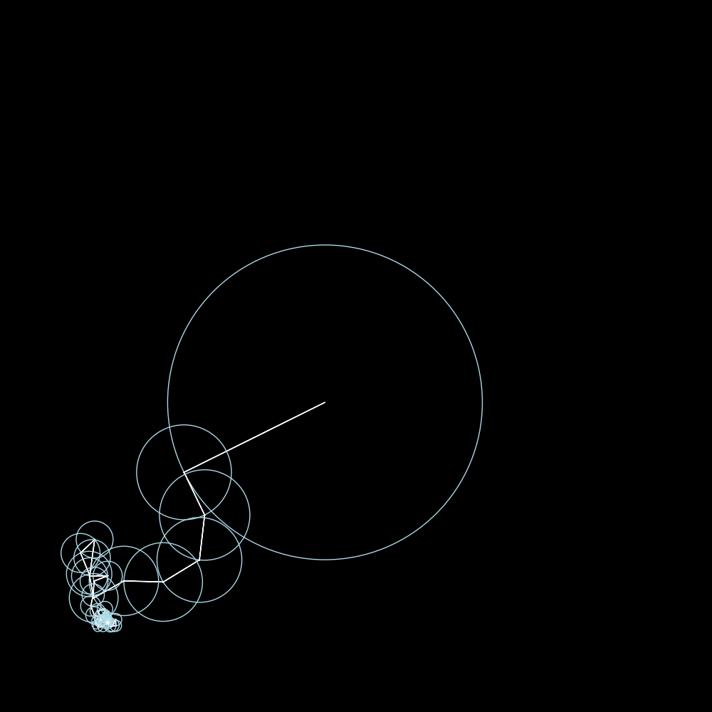

A quick notebook to create an animation of a bunch of circles drawing an image. Inspired by the 3blue1brown video on the [Fast Fourier Transform](https://youtu.be/r6sGWTCMz2k).

Use the `make_path.ipynb` notebook to generate a one line path from an SVG. The `input/me.svg` should be an SVG file with a single path inside it. The notebook will generate an ordered set of points that will be used to draw the FFT image.

After that, use `main.ipynb` to generate the animation. In the beginning when setting the curve, I'd recommend to subsample the image to around 200-300 points. This will reduce the number of circles needed to draw the image and make the animation faster.

The `main.ipynb` notebook will generate frames of the circles drawing the image inside `tmp/*`. The video will be saved as the `out.mp4` file.

    

